# Learnable B-Spline Activation Functions for Mitigating Catastrophic Forgetting in Continual Learning


This repository contains the implementation of my undergraduate thesis:

**Title**:  
**"Employing Learnable B-Spline Activation Functions to Address Catastrophic Forgetting in Neural Networks"**  
**Author**: Mahdi Razi Gandomani  
**Supervisors**: Dr. Ali Mohades  
**Institution**: Amirkabir University of Technology
**Date**: April 2025

---

## Abstract

Inspired by recent developments in Kolmogorov-Arnold Networks (KANs) [1], this thesis explores learnable B-spline activation functions as a mechanism to mitigate catastrophic forgetting in continual learning. Unlike KANs, which place learnable activation functions on every edge of the network, our approach shares a single B-spline activation function across each layer, significantly reducing runtime overhead while maintaining the beneficial properties of learnable activations. Through experiments on Permuted MNIST, we demonstrate that B-spline activations achieve superior performance compared to other activation functions (ReLU, Tanh, GELU, PReLU) across multiple continual learning metrics.

---

## 1. Introduction

### 1.1 Catastrophic Forgetting

Catastrophic forgetting, refers to the phenomenon where neural networks abruptly and drastically forget previously learned information upon learning new information [2]. This represents a fundamental challenge in continual learning scenarios where neural networks must learn sequential tasks without forgetting prior knowledge. The main cause of catastrophic interference is the overlap in representations at the hidden layer of distributed neural networks, where each input tends to create changes in the weights of many nodes.

### 1.2 B-Splines: Mathematical Foundation

B-splines (basis splines) are piecewise polynomial functions designed to have minimal support for a given degree, smoothness, and set of knots [3]. They possess several critical properties that make them suitable for neural network activation functions:

**Local Support Property**: B-spline basis functions $B_{i,p}(x)$ are non-zero only on the interval $[t_i, t_{i+p+1}]$ [3,4]. This means that changing a control point affects only a local region of the function, not the entire function globally. As stated in the literature, "thanks to the local support property of B-splines, such a network stores the information locally, which means that learning in one part of the input space minimally affects the rest of it" [5].


**Cox-de Boor Recursion Formula**: B-splines can be computed efficiently using the Cox-de Boor recursion formula:

$$B_{i,0}(x) = \begin{cases} 1 & \text{if } t_i \leq x < t_{i+1} \\ 0 & \text{otherwise} \end{cases}$$

$$B_{i,k}(x) = \frac{x - t_i}{t_{i+k} - t_i}B_{i,k-1}(x) + \frac{t_{i+k+1} - x}{t_{i+k+1} - t_{i+1}}B_{i+1,k-1}(x)$$

where $t_i$ are knot values and $k$ is the degree.

A B-spline function is then represented as a linear combination:

$$f(x) = \sum_{i=1}^{n} c_i B_{i,k}(x)$$

where $c_i$ are learnable control point coefficients.

### 1.3 Motivation: KANs Without Runtime Overhead

Kolmogorov-Arnold Networks have demonstrated promising performance in addressing catastrophic forgetting in continual learning tasks [1,7].The claim is that KAN avoids catastrophic forgetting by leveraging the locality of splines: since spline bases are local, a sample will only affect nearby spline coefficients, leaving faraway coefficients intact. However, this architecture introduces significant computational overhead due to the large number of learnable activation functions.

Our approach differs by sharing a single learnable B-spline activation function per layer rather than per edge. This design choice dramatically reduces the number of learnable parameters while preserving the local adaptation properties of B-splines.

---

## 2. Methodology

### 2.1 B-Spline Activation Function Implementation

Our B-spline activation function is implemented as a PyTorch module with the following key components:

**Parameters**:
- `num_control_points`: Number of control points defining the spline
- `degree`: Polynomial degree of the B-spline
- `start_point`, `end_point`: Domain boundaries
- `init`: Initialization strategy ('relu', 'leaky_relu', 'identity', or 'random')

**Initialization Strategies**:
The control points $c_i$ can be initialized to approximate standard activation functions:
- **ReLU**: $c_i = \max(0, x_i)$
- **Leaky ReLU**: $c_i = \max(0.1x_i, x_i)$
- **Identity**: $c_i = x_i$
- **Random**: $c_i \sim \mathcal{N}(0, 1)$

where $x_i$ are uniformly spaced points in $[{start}, {end}]$.

### 2.2 Network Architecture

<!-- We employ two model architectures: -->

**Multi-Layer Perceptron (MLP)**: For Permuted MNIST, consisting of:
- Input layer: 784 dimensions (flattened 28×28 images)
- Hidden layers: [256, 256] neurons (following configurations reported in the literature for this experiment)
- Output layer: 10 classes
- Shared B-spline activation per layer

<!-- **Convolutional Neural Network (CNN)**: For Split CIFAR-10, consisting of:
- Convolutional layers: [32, 64, 128] channels with 3×3 kernels
- Batch normalization and max pooling after each convolutional block
- Fully connected layers: [256] neurons
- Output layer: 2 classes per task
- Shared B-spline activation per layer -->

### 2.3 Continual Learning Benchmarks

**Permuted MNIST** : A sequence of 10 tasks where each task applies a fixed random permutation to the pixels of MNIST images. This benchmark tests domain-incremental learning where the input distribution changes but the task structure remains constant.

<!-- **Split CIFAR-10**: A sequence of 5 binary classification tasks, each distinguishing between 2 of the 10 CIFAR-10 classes. This tests class-incremental learning. -->

### 2.4 Evaluation Metrics

We evaluate performance using standard continual learning metrics [9]:

**Average Accuracy**: The mean test accuracy across all tasks after training on all tasks:
$$\text{Acc} = \frac{1}{T} \sum_{j=1}^{T} R_{T,j}$$

where $R_{i,j}$ is the test accuracy on task $j$ after training through task $i$, and $T$ is the total number of tasks.

**Forgetting**: The average amount of knowledge forgotten across all tasks:
$$\text{Forgetting} = \frac{1}{T-1} \sum_{j=1}^{T-1} \left( \max_{i \in \{j,...,T\}} R_{i,j} - R_{T,j} \right)$$

**Backward Transfer (BWT)**: The influence of learning new tasks on the performance of previous tasks:
$$\text{BWT} = \frac{1}{T-1} \sum_{j=1}^{T-1} (R_{T,j} - R_{j,j})$$

Positive BWT indicates positive backward transfer (new learning helps old tasks), while negative BWT indicates forgetting.

**Plasticity**: The average ability to learn each new task:
$$\text{Plasticity} = \frac{1}{T} \sum_{j=1}^{T} R_{j,j}$$


### 2.5 Training Protocol
- **No replay buffer**: Pure continual learning without storing past data
- **No explicit regularization**: Tests raw ability of activations to preserve knowledge
- **Sequential training**: Tasks learned one after another
- **5 epochs per task** with cosine annealing learning rate schedule
- **3 random seeds** for statistical reliability


---

## 3. Experimental Results

### 3.1 Activation Function Comparison

In Permuted MNIST benchmark, B-spline activations consistently outperformed other activation functions for continual learning without applying any explicit continual learning method:


<p align="center">
  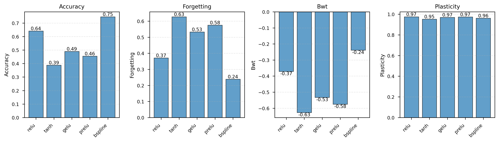
</p> 


- B-spline achieves the highest average accuracy (0.75) with ReLU X it with (0.64)
- B-spline shows the lowest forgetting (0.24) compared to ReLU (0.37), Tanh (0.63), GELU (0.53), and PReLU (0.58)
- B-spline demonstrates the best backward transfer (BWT: -0.24) among all methods

This table quantifies the final results:

| Metric | ReLU | tanh | GELU | PReLU | **B-spline** |
|--------|------|------|------|-------|-------------|
| **Accuracy ↑** | 0.64 | 0.39 | 0.49 | 0.46 | **0.75** |
| **Forgetting ↓** | 0.37 | 0.63 | 0.54 | 0.58 | **0.24** |
| **BWT ↑** | -0.37 | -0.63 | -0.54 | -0.58 | **-0.24** |

**Key findings:**
- B-spline achieves **17-92% higher accuracy** than other activations
- B-spline shows **35-62% less forgetting** compared to alternatives
- All methods show similar plasticity (~0.97-0.99), confirming the difference is in **retention, not learning capacity**


<p align="center">
  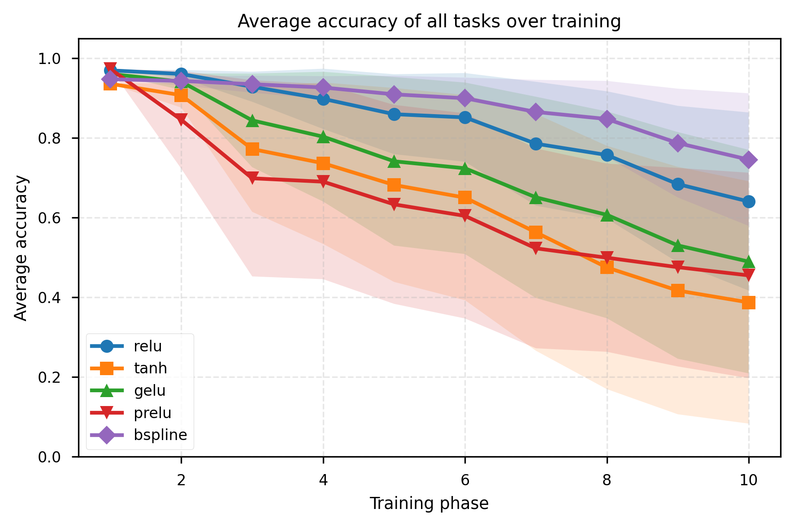
</p>


The B-spline activation (purple line) demonstrates **substantially better retention** of past knowledge compared to all other activations. While ReLU, tanh, GELU, and PReLU all show severe degradation (dropping to 38-64% final accuracy), B-spline maintains approximately 74% accuracy with a much more gradual decline.


<!-- per_task_accuracy_bspline -->


### 3.2 Ablation Studies

We conduct ablation studies to systematically evaluate the impact of key hyperparameters on model performance.

#### 3.2.1 Number of Control Points

Analysis of 3, 5, 7, 10, 15 and 25 control points reveals:
- **Accuracy increases with control point count**: From 0.45 (3 points) to 0.81 (15 points) and 0.84 (25 points)
- **Forgetting decreases with more control points**: From 0.56 (3 points) to 0.17 (17 points) and 0.14 (25 points)

<p align="center">
  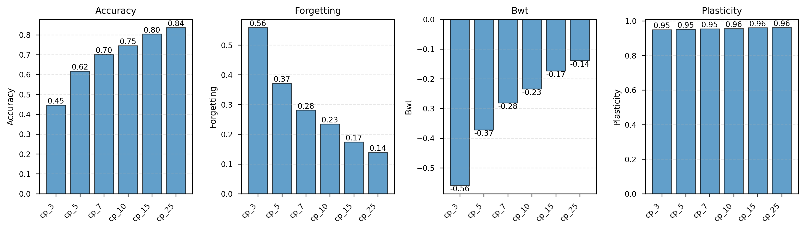
</p>

More control points provide greater expressiveness but add parameters and significant runtime overhead. This aligns with approximation theory: B-splines with more control points can approximate more complex functions while maintaining local control [4,5]. These heatmaps highlight this trade-off by visually confirming that larger control point counts preserve accuracy across all tasks.

<p align="center">
  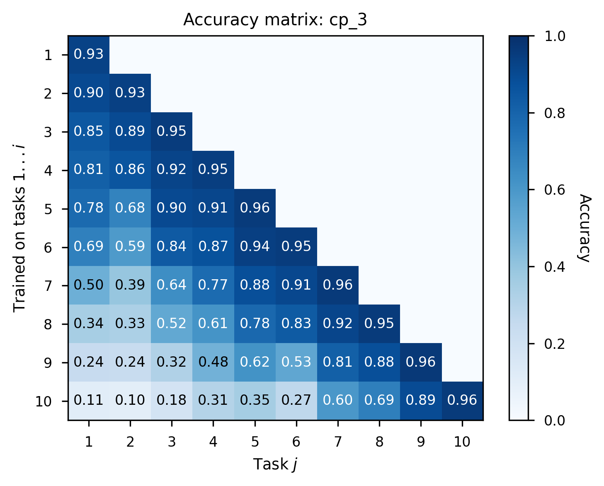
  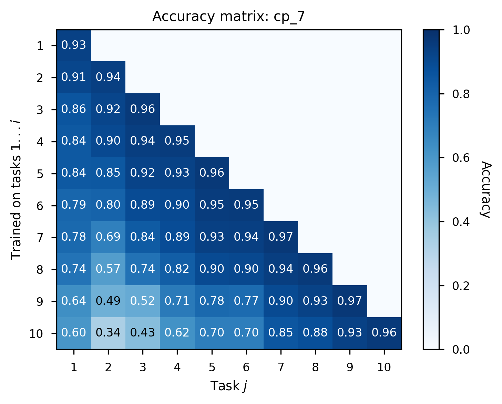
  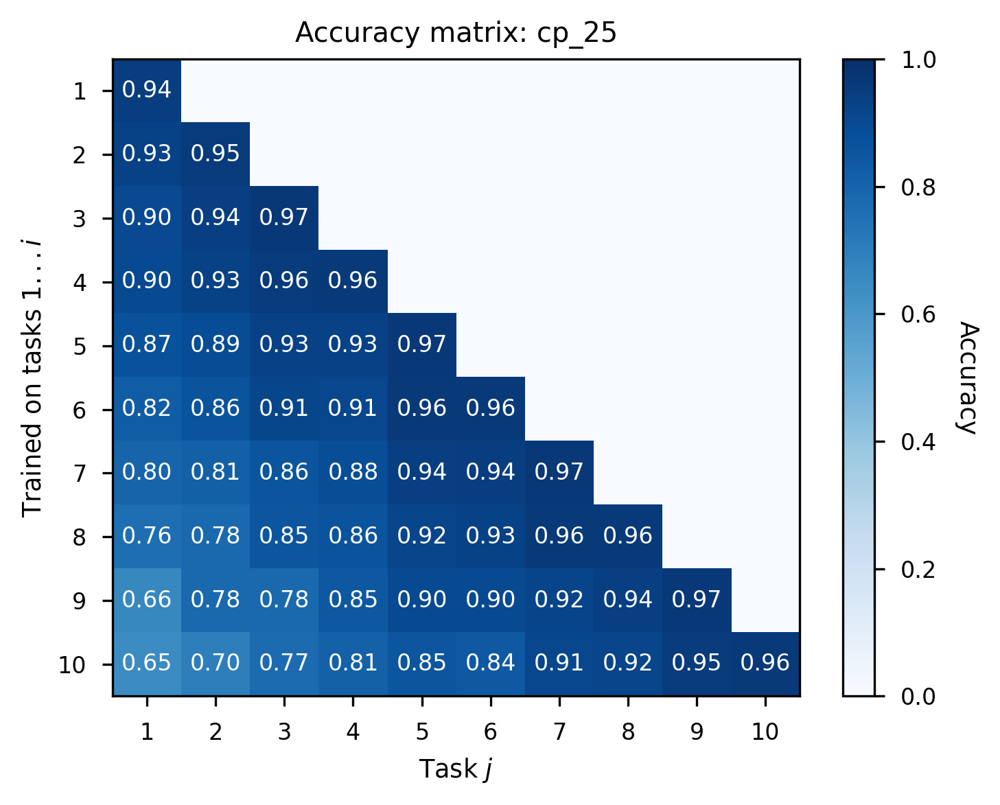
</p>


#### 3.2.2 B-Spline Degree

Comparing degrees 1 through 5:
- **Degree 1 (linear) performs best!**: Accuracy 0.77, Forgetting 0.21
- **Higher degrees show diminishing returns**: Degree 3 (accuracy 0.62, forgetting 0.37) and degree 5 (accuracy 0.56, forgetting 0.47) perform progressively worse

<p align="center">
  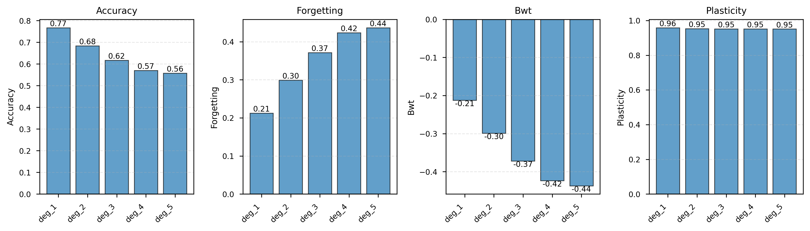
</p>


It seems lower-degree splines provide sufficient expressiveness while maintaining simpler, more stable optimization landscapes. Linear piecewise B-splines provide sufficient flexibility without overfitting and are efficient in this continual learning setting.


#### 3.2.3 Domain Bounds

Testing bounds of (-1,1), (-2,2), (-3,3), and (-5,5):
- **Intermediate bounds (-1,1) and (-2,2) perform best**
- **Wider bounds reduce performance**:

<p align="center">
  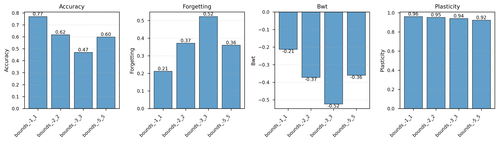
</p>

#### 3.2.4 Initialization Strategy

Comparing random, identity, ReLU, and leaky ReLU initialization:
- **ReLU and Leaky ReLU initialization perform best**: Both achieve accuracy ~0.70-0.73 and forgetting ~0.25-0.28
- **Identity initialization shows competitive performance**: Accuracy 0.51, forgetting 0.48
- **Random initialization underperforms**: Accuracy 0.61, forgetting 0.39

<p align="center">
  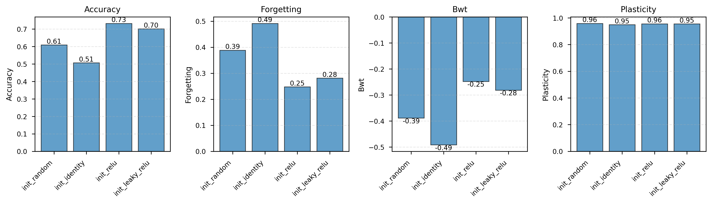
</p>

ReLU and leaky ReLU initialization achieve the best performance with high accuracy and low forgetting, while random initialization underperforms. Identity initialization is moderately effective, showing competitive but lower accuracy and higher forgetting.


### 3.3 Continual Regression Experiment

In the continual regression task with 7 sequential peaks, B-splines demonstrate remarkable ability to retain previously learned functions while adapting to new ones. Unlike ReLU activations which exhibit severe catastrophic forgetting (completely losing earlier peaks), B-spline activations maintain knowledge of all previously learned peaks throughout training.

This experiment directly validates the locality hypothesis: B-splines can learn new regions of the function space (new peaks) without catastrophically overwriting existing learned regions (previous peaks).

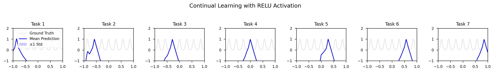
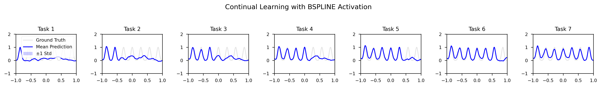


---

## 4. Discussion

### 4.1 Why Do B-Splines Mitigate Catastrophic Forgetting?

Our results can be explained through the lens of existing continual learning theory and the mathematical properties of B-splines:

**1. Locality and Reduced Representational Overlap**

One key mechanism contributing to catastrophic forgetting is the overlap in representations when networks use shared weights to store information [2]. B-splines provide a mechanism to reduce this overlap through their local support property. As established in the literature, B-spline neural networks can store information locally, meaning learning in one part of the input space minimally affects the rest [5].

When a B-spline activation learns to respond to inputs from a new task, only the control points in the relevant region of the input space need to be updated. Control points outside this region remain largely unchanged, preserving the network's response to previous tasks. 


**2. Flexibility Without Excessive Parameterization**

Studies on learnable activation functions have shown they allow for "a reduction of the overall size of the network for a given accuracy" due to their flexibility [5]. Our shared B-spline approach balances this flexibility with parameter efficiency: each layer has only `num_control_points` additional parameters (e.g., 15 parameters for default configuration), compared to KANs which would require this many parameters per edge.


---

## 5. Configuration

Based on ablations, the recommended B-spline configuration is:

```python
bSpline(num_control_points=15, degree=1, start_point=-1.0, end_point=1.0, init='relu')
```

With training hyperparameters (chosen wiht a simple random grid search):
- Optimizer: SGD with momentum=0.9
- Learning rate: 0.0003
- Weight decay: 1e-4
- LR schedule: Cosine annealing

---

## 6. Project Structure

```
.
├── activations.py      # B-spline activation implementation
├── datasets.py         # Permuted MNIST and Split CIFAR-10 loaders
├── models.py          # MLP and CNN architectures
├── trainer.py         # Training loop and continual learning protocol
├── metrics.py         # CL metrics
├── regress.py         # Continual regression visualization experiment
├── runner.py          # Main experiment runner
└── visualize.py       # Plotting and analysis functions
```

---

## 7. Usage

### Compare activations on Permuted MNIST:
```bash
python3 runner.py --exp compare --dataset permuted_mnist --num_seeds 5
```

### Run ablation studies:
```bash
python3 runner.py --exp ablations --dataset permuted_mnist --num_seeds 5
```

### Visualize continual regression:
```bash
python3 runner.py --exp regression --num_peaks 7 --num_seeds 3
```

### Compare on Split CIFAR-10:
```bash
python3 runner.py --exp compare --dataset split_cifar10 --num_seeds 3
```


## 8. Conclusion

This work demonstrates that learnable B-spline activation functions offer a practical and effective approach to mitigating catastrophic forgetting in continual learning. By leveraging the local support property of B-splines while maintaining computational efficiency through parameter sharing, this method achieves superior performance across multiple benchmarks and metrics compared to other activation functions.

The local support property of B-splines appears to be key to their success, enabling learning in one region of the input space to minimally interfere with previously learned regions.

<p align="center">
  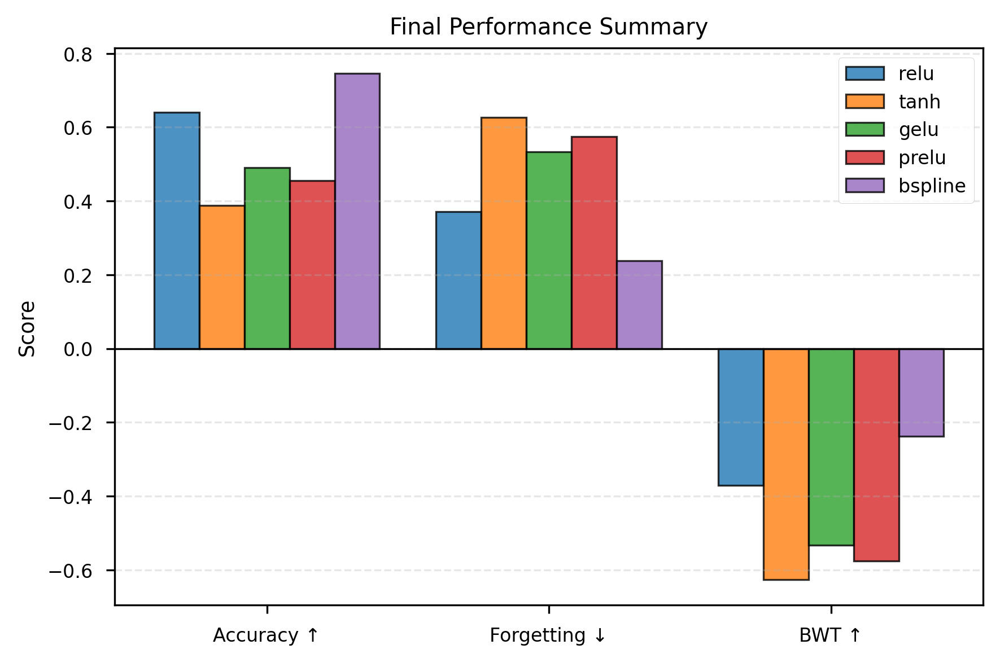
</p>


## 9. Key Insights

1. **Learnable activations significantly reduce catastrophic forgetting** without requiring replay buffers, regularization, or architectural modifications

2. **Layer-wise sharing is sufficient** - per-edge learnable functions (as in KAN) are not necessary for continual learning benefits

3. **Simpler is better**: Linear B-splines (degree 1) with 15-25 control points outperform higher-degree splines. NEEDS ADDITOINAL EXPREIMENT.

4. **Initialization matters**: Starting from ReLU-like shapes provides better training dynamics than random or identity initialization

5. **Bounded domains focus learning**: Narrow activation ranges (-1 to 1) work better than wide ranges


The key insight is that **how we transform representations (activations) matters as much as what representations we learn (weights)** - and making both learnable gives neural networks greater flexibility to balance stability and plasticity across sequential tasks.


## 10 Limitations and Future Work

**Computational Cost**: While more efficient than full KANs, B-spline activations still incur additional computation compared to fixed activations. Future work could explore optimized implementations or hardware acceleration.

**Hyperparameter Sensitivity**: Our ablation studies reveal sensitivity to the number of control points, degree, and domain bounds. Adaptive methods for setting these hyperparameters based on task characteristics would be valuable.

**Scaling to Deeper Networks**: Our experiments focus on relatively shallow networks. Investigation of B-spline activations in modern deep architectures (ResNets, Transformers) is needed.

**Hybrid with CL methods**: Combining B-spline activations with explicit continual learning strategies (regularization, replay, etc.)

**Theoretical Guarantee**: Understanding the theoretical properties that make certain configurations more effective


## References

[1] Liu, Z., Wang, Y., Vaidya, S., Ruehle, F., Halverson, J., Soljačić, M., ... & Tegmark, M. (2024). Kan: Kolmogorov-arnold networks. arXiv preprint arXiv:2404.19756.

[2] McCloskey, M., & Cohen, N. J. (1989). Catastrophic interference in connectionist networks: The sequential learning problem. Psychology of Learning and Motivation, 24, 109-165.

[3] de Boor, C. (2001). A Practical Guide to Splines. Springer-Verlag.

[4] Bohra, P., Campos, J., Gupta, H., Aziznejad, S., & Unser, M. (2020). Learning activation functions in deep (spline) neural networks. IEEE Open Journal of Signal Processing, 1, 295-309.

[5] Coelho, A. A. R., & Pessôa, A. V. L. (2009). A local approach to B-spline neural network. Neural Networks, 22(5-6), 610-616.

[6] Shene, C. K. (n.d.). B-spline basis functions: Important properties. Michigan Technological University.

[7] Bozorgasl, Z., & Chen, H. (2024). SineKAN: Kolmogorov-Arnold Networks using sinusoidal activation functions. Frontiers in Artificial Intelligence.


[8] Goodfellow, I. J., Mirza, M., Xiao, D., Courville, A., & Bengio, Y. (2013). An empirical investigation of catastrophic forgetting in gradient-based neural networks. arXiv preprint arXiv:1312.6211.

[9] Díaz-Rodríguez, N., Lomonaco, V., Filliat, D., & Maltoni, D. (2018). Don't forget, there is more than forgetting: New metrics for continual learning. Workshop on Continual Learning, NeurIPS.


---

## 📬 Contact

For any questions or suggestions, please reach out to:

- **Email**: [mahdi.razi@aut.ac.ir]

---

## ⭐ Acknowledgments

Special thanks to my supervisors **Dr. Ali Mohades** for their invaluable guidance and support throughout this project.

---
